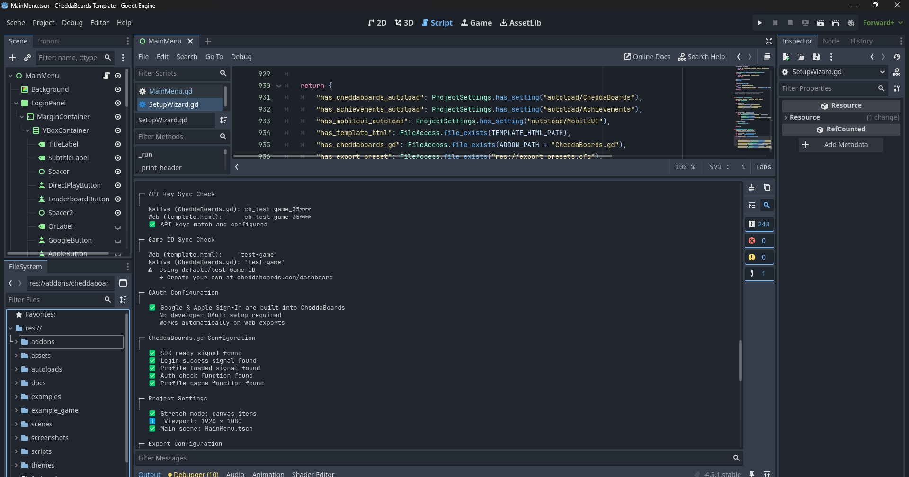

<p align="center">
  
</p>

# CheddaBoards Godot 4 Template

> **SDK Version:** 1.9.0 | [Changelog](docs/CHANGELOG.md)

<p align="center">
  
  
</p>

A complete game template with leaderboards, achievements, and authentication built in.

**Download → Add your game → Export. That's it.**

Zero servers. $0 for indie devs. Windows, Mac, Linux, Mobile, Web.

---

## Current Status

| Platform | Status | Notes |
|----------|--------|-------|
| **Native (Windows/Mac/Linux)** | ✅ Stable | HTTP API + Device Code Auth |
| **Mobile** | ✅ Stable | HTTP API + Device Code Auth |
| **Web** | ✅ Stable | HTTP API + direct OAuth |

> **Note:** All platforms support Google/Apple Sign-In via Device Code Auth — no browser integration or OAuth SDKs needed in your game. Web also supports direct OAuth and anonymous account upgrade.

---

## What's Included

| Component | Description |
|-----------|-------------|
| **Game Wrapper** | Drop-in wrapper handles HUD, game over, score submission |
| **Example Game** | CheddaClick - clicker game with levels & combos |
| **MainMenu** | Four-panel auth flow with anonymous dashboard |
| **Leaderboard** | Full UI with time periods & archives |
| **AchievementsView** | Achievement list with progress |
| **AchievementNotification** | Popup system for unlocks |
| **CheddaBoards SDK** | Core backend integration |
| **Achievements System** | Backend-synced achievements |

---

## What's New in v1.9.0

### Device Code Authentication (Cross-Platform)
- **Google & Apple Sign-In on ANY platform** — no browser popups, no OAuth SDKs
- Game shows a code and URL → player signs in on their phone → game picks up the session
- Same flow works on Windows, Mac, Linux, Mobile, Web, consoles, anything
- Uses OAuth 2.0 Device Authorization Grant (RFC 8628) — same pattern as Netflix, YouTube on TV, GitHub CLI
- Developers need zero auth dependencies — just two HTTP calls and a text label

### Cross-Platform Account Linking
- Players can link anonymous accounts to Google or Apple via device code flow
- Preserves all scores, achievements, and progress
- Enables cross-device sync across any platform
- Works from both the in-game menu and the Anonymous Dashboard

### How Device Code Auth Works

```
┌─────────────┐                    ┌──────────────────────┐
│  Your Game   │                    │  Player's Phone      │
│              │                    │                      │
│  "Go to      │                    │  cheddaboards.com/   │
│   cheddaboards│                   │  link                │
│   .com/link" │                    │                      │
│              │                    │  Enter: CHEDDA-7K3M  │
│  "Enter code:│                    │  [Google] [Apple]    │
│   CHEDDA-7K3M"│                   │                      │
│              │    polls every 5s  │  ✅ Signed in!       │
│  ✅ Logged in!│◄──────────────────│                      │
└─────────────┘                    └──────────────────────┘
```

```gdscript
# In your game - that's it, no OAuth SDKs needed
CheddaBoards.login_google_device_code("PlayerName")

# Listen for the code to display
CheddaBoards.device_code_received.connect(func(url, code, expires_in):
    show_label("Go to %s and enter: %s" % [url, code])
)

# Login completes automatically via polling
CheddaBoards.login_success.connect(func(nickname):
    print("Welcome, %s!" % nickname)
)
```

---

## What's New in v1.7.0

### Modular Game Wrapper Architecture
- **Game.gd/Game.tscn** now acts as a wrapper that handles all CheddaBoards integration
- Drop in ANY game scene - just emit 4 signals and you're done
- Your game stays clean - no SDK code mixed with gameplay
- Example game (CheddaClick) included in `example_game/` folder

### Account Upgrade (Web)
- Anonymous players can link their account to Google or Apple
- Preserves all scores and achievements
- Enables cross-device sync
- Available from the Anonymous Dashboard panel

### Clean Folder Structure
- `scenes/` - All .tscn files
- `scripts/` - All .gd files  
- `autoloads/` - Achievements.gd, MobileUI.gd
- `example_game/` - CheddaClick example
- `addons/cheddaboards/` - SDK only

### Updated Setup Wizard
- Now checks new folder structure
- Auto-configures all autoloads including MobileUI

---

## Features

### Platform Support

- **Native exports** - HTTP API for Windows, Mac, Linux, Mobile
- **Web exports** - HTTP API with direct OAuth option
- **Anonymous play** - No account required, instant play with device ID
- **Device Code Auth** - Google/Apple Sign-In on any platform, no OAuth SDKs needed
- **Cross-platform** - Same codebase works everywhere
- **Account linking** - Upgrade anonymous accounts to Google/Apple from any platform

### Game Wrapper System (v1.7.0)

<p align="center">
  
</p>

The new modular architecture separates your game from CheddaBoards integration:

| Component | What It Does |
|-----------|--------------|
| **Game.gd (Wrapper)** | HUD, game over panel, score submission, achievements |
| **Your Game** | Just gameplay - emit signals for score/stats/game over |

```gdscript
# Your game just needs these 4 signals:
signal score_changed(score: int, combo: int)
signal stats_changed(hits: int, misses: int, level: int)
signal time_changed(time_remaining: float, max_time: float)
signal game_over(final_score: int, stats: Dictionary)

# Emit them when things happen:
score_changed.emit(current_score, combo_multiplier)
game_over.emit(final_score, {"hits": 50, "accuracy": 85, "max_combo": 8, "level": 3})
```

### Authentication Flow

The MainMenu supports a four-panel authentication system:

| Panel | When Shown | Features |
|-------|------------|----------|
| **Login Panel** | First-time players | PLAY NOW, Leaderboard, login buttons |
| **Name Entry** | Before first game | Custom nickname input |
| **Anonymous Dashboard** | Returning anonymous players | Stats, achievements, **upgrade to Google/Apple** |
| **Main Panel** | Logged-in users | Full profile with all features |

### Anti-Cheat

<p align="center">
  
</p>

Built-in server-side protection — no code required. Configure limits from your dashboard and CheddaBoards enforces them automatically.

| Protection | How It Works |
|------------|-------------|
| **Play Sessions** | Server tracks real play time — scores without a valid session are rejected |
| **Score Validation** | Backend calculates max possible score based on elapsed time |
| **Rate Limiting** | Blocks rapid-fire score submissions from bots or scripts |
| **Score Caps** | Set max score/streak per submission and absolute lifetime caps |

Set your limits based on your game's mechanics (e.g. max 200,000 points per round, max streak of 10), then tighten based on real player data. See your game's Security tab on the dashboard.

### Authentication

| Method | Native | Mobile | Web | Status |
|--------|--------|--------|-----|--------|
| Anonymous / Device ID | ✅ | ✅ | ✅ | **Working** |
| Google Sign-In (Device Code) | ✅ | ✅ | ✅ | **Working** |
| Apple Sign-In (Device Code) | ✅ | ✅ | ✅ | **Working** |
| Account Upgrade (Anon → Google/Apple) | ✅ | ✅ | ✅ | **Working** |
| Google Sign-In (direct OAuth) | — | — | ✅ | **Working** |
| Apple Sign-In (direct OAuth) | — | — | ✅ | **Working** |

> **Device Code Auth (v1.9.0):** Works on every platform. The game displays a code and URL, the player signs in on their phone browser, and the game picks up the session automatically. No OAuth SDKs, no browser popups, no platform-specific code. Anonymous players can also upgrade their account to Google/Apple from any platform, preserving all progress.
>
> **Direct OAuth (Web only):** Web builds can also use direct Google/Apple Sign-In buttons for a streamlined browser experience.

### Leaderboards

<p align="center">
  
  
</p>

- Global leaderboard with rankings
- Sort by score or streak
- Custom nicknames for anonymous players
- Your entry highlighted

### Timed Scoreboards

<p align="center">
  
</p>

Run weekly, daily, or monthly competitions that reset and archive automatically — zero maintenance.

| Type | Resets | Archives Kept | Use Case |
|------|--------|---------------|----------|
| **All-Time** | Never | — | Career high scores |
| **Weekly** | Every Monday | 52 | Weekly competitions |
| **Daily** | Every midnight | 90 | Daily challenges |
| **Monthly** | 1st of month | 12 | Monthly tournaments |

- Create scoreboards from the dashboard — no code changes needed
- Previous periods archived automatically with full leaderboard data
- Built-in UI shows "Current" vs "Last Week" toggle
- Winner highlighted with crown in archive view
- Hall of fame across multiple archived periods

> 📖 **Full guide:** [TIMED_LEADERBOARDS.md](docs/TIMED_LEADERBOARDS.md)

### Achievements

<p align="center">
  
</p>

- Configurable achievement definitions
- **Score-first submission** - Score submits immediately, achievements sync silently
- **Deferred sync** - Failed achievements re-queue automatically
- **Session tracking** - Track combos, levels, special actions per run
- Automatic unlocking based on score/streak/games played
- **Level achievements** - Unlock for reaching game levels
- Popup notifications with batch support
- Offline support with local caching
- Works for anonymous players (local storage)

---

## Prerequisites

- **Godot 4.x** (tested on 4.3+)
- **CheddaBoards Account** - Free at [cheddaboards.com](https://cheddaboards.com)
- **Game ID** - Register your game on the dashboard
- **API Key** - For native/anonymous builds (get from dashboard)

---

## Quick Start

### 1. Setup

<p align="center">
  
</p>

1. Download the template from Asset Library or GitHub
2. Open in Godot 4.x
3. Run Setup Wizard: `File → Run → addons/cheddaboards/SetupWizard.gd`
4. Enter your Game ID & API key from [cheddaboards.com](https://cheddaboards.com)

### 2. Add Your Game

1. Create your game scene (e.g., `example_game/MyGame.tscn`)
2. Add the 4 required signals to your game script
3. Emit signals when score/stats change and game ends
4. Set `game_scene_path` in `scenes/Game.tscn` to your game
5. Export → Players get leaderboards & achievements!

### 3. Required Signals

```gdscript
extends Control

# Required signals - GameWrapper listens to these
signal score_changed(score: int, combo: int)
signal stats_changed(hits: int, misses: int, level: int)
signal time_changed(time_remaining: float, max_time: float)
signal game_over(final_score: int, stats: Dictionary)

func _on_player_scored(points: int):
    current_score += points
    score_changed.emit(current_score, combo_multiplier)

func _on_game_ended():
    game_over.emit(current_score, {
        "hits": total_hits,
        "misses": total_misses,
        "max_combo": max_combo,
        "level": current_level,
        "accuracy": calculate_accuracy()
    })
```

### 4. Optional: Quick Restart

Add a `restart()` method for fast restarts without scene reload:

```gdscript
func restart():
    current_score = 0
    time_remaining = 30.0
    _start_game()
```

---

## Template Structure

```
CheddaBoards-Godot/
├── addons/
│   └── cheddaboards/
│       ├── CheddaBoards.gd       # Core SDK (Autoload)
│       ├── SetupWizard.gd        # Setup & validation tool
│       ├── cheddaboards_logo.png
│       └── icon.png
├── autoloads/
│   ├── Achievements.gd           # Achievement system (Autoload)
│   └── MobileUI.gd               # Mobile scaling (Autoload)
├── scenes/
│   ├── Game.tscn                 # Game wrapper (loads your game)
│   ├── MainMenu.tscn             # Four-panel auth flow
│   ├── Leaderboard.tscn          # Leaderboard with archives
│   ├── AchievementsView.tscn     # Achievement list
│   ├── AchievementNotification.tscn
│   └── DeviceCodeLogin.tscn      # Device code auth UI
├── scripts/
│   ├── Game.gd                   # Game wrapper logic
│   ├── MainMenu.gd               # Menu logic
│   ├── Leaderboard.gd            # Leaderboard logic
│   ├── AchievementsView.gd       # Achievement list logic
│   ├── AchievementNotification.gd
│   └── DeviceCodeLogin.gd        # Device code auth flow
├── example_game/
│   ├── CheddaClickGame.tscn      # Example clicker game
│   ├── CheddaClickGame.gd        # Example game logic
│   └── cheese.png                # Game assets
├── assets/
│   └── fonts/
│       └── ZeroCool.ttf
├── themes/
│   └── Buttons.tres
├── screenshots/
│   ├── screenshot1.png
│   ├── screenshot2.png
│   ├── screenshot_achievements.png
│   ├── screenshot_anticheat.png
│   ├── screenshot_gameover.png
│   ├── screenshot_leaderboard_alltime.png
│   ├── screenshot_leaderboard_archive.png
│   ├── screenshot_leaderboard_weekly.png
│   └── screenshot_setup_wizard.png
├── docs/
│   ├── API_QUICKSTART.md
│   ├── CHANGELOG.md
│   ├── QUICKSTART.md
│   ├── SETUP.md
│   ├── TIMED_LEADERBOARDS.md
│   └── TROUBLESHOOTING.md
├── template.html                 # Web export template
├── project.godot                 # Pre-configured project
├── favicon.ico
├── LICENSE
└── README.md
```

---

## Autoload Setup

The Setup Wizard configures these automatically, or set manually:

| Name | Path |
|------|------|
| CheddaBoards | `res://addons/cheddaboards/CheddaBoards.gd` |
| Achievements | `res://autoloads/Achievements.gd` |
| MobileUI | `res://autoloads/MobileUI.gd` |

---

## Configuration

### Game ID & API Key

Set via Setup Wizard, or manually in `CheddaBoards.gd`:

```gdscript
var game_id: String = "your-game-id"
var api_key: String = "cb_your_api_key_here"
```

Or at runtime:

```gdscript
func _ready():
    CheddaBoards.set_api_key("cb_your_api_key_here")
```

### Game Scene Path

In `scenes/Game.tscn`, set the exported variable:

```gdscript
@export var game_scene_path: String = "res://example_game/CheddaClickGame.tscn"
```

### Scoreboard Configuration

In `scripts/Leaderboard.gd`:

```gdscript
const SCOREBOARD_ALL_TIME: String = "all-time"
const SCOREBOARD_WEEKLY: String = "weekly"
```

---

## Signals Reference

### CheddaBoards.gd

```gdscript
# Initialization
signal sdk_ready()
signal init_error(reason: String)

# Authentication
signal login_success(nickname: String)
signal login_failed(reason: String)
signal login_timeout()
signal logout_success()

# Device Code Auth (v1.9.0)
signal device_code_received(url: String, code: String, expires_in: int)
signal device_code_expired()

# Account Upgrade
signal account_upgraded(provider: String)
signal account_upgrade_failed(reason: String)

# Profile
signal profile_loaded(nickname: String, score: int, streak: int, achievements: Array)
signal no_profile()
signal nickname_changed(new_nickname: String)

# Scores
signal score_submitted(score: int, streak: int)
signal score_error(reason: String)

# Leaderboards
signal leaderboard_loaded(entries: Array)
signal scoreboard_loaded(scoreboard_id: String, config: Dictionary, entries: Array)
signal scoreboard_rank_loaded(scoreboard_id: String, rank: int, score: int, streak: int, total: int)

# Play Sessions
signal play_session_started(token: String)
signal play_session_error(reason: String)
```

### Achievements.gd

```gdscript
signal achievement_unlocked(achievement_id: String, achievement_name: String)
signal achievements_ready()
```

### Your Game (required)

```gdscript
signal score_changed(score: int, combo: int)
signal stats_changed(hits: int, misses: int, level: int)
signal time_changed(time_remaining: float, max_time: float)
signal game_over(final_score: int, stats: Dictionary)
```

---

## Debugging

### Common Issues

| Issue | Solution |
|-------|----------|
| "API key not set" | Set `api_key` in CheddaBoards.gd or run Setup Wizard |
| "Game ID not set" | Set `game_id` in CheddaBoards.gd or run Setup Wizard |
| Game not loading | Check `game_scene_path` points to correct .tscn file |
| Script not found | Ensure .tscn files reference scripts in `scripts/` folder |
| Score not submitting | Check `is_authenticated()` and connect to `score_error` |
| Web blank screen | Use local server, not `file://`. Export as `index.html` |

---

## Version History

| Version | Date | Changes |
|---------|------|---------|
| **v1.9.0** | **2025-02-23** | **Device Code Auth (cross-platform Google/Apple), account linking on all platforms** |
| v1.7.0 | 2025-02-05 | Modular GameWrapper, account upgrade (web), clean folder structure |
| v1.6.0 | 2025-01-16 | Anonymous dashboard, score-first achievements |
| v1.5.0 | 2025-01-14 | Play session anti-cheat, time validation |
| v1.4.0 | 2025-01-04 | OAuth in Setup Wizard, nickname fixes |
| v1.3.0 | 2024-12-30 | Timed scoreboards, archives, level system |
| v1.2.0 | 2024-12-15 | Anonymous play with device ID |
| v1.1.0 | 2024-12-03 | Setup Wizard, Asset Library structure |
| v1.0.0 | 2024-11-02 | Initial release |

---

## Roadmap

- [ ] Unity SDK (in progress)
- [ ] Expanded analytics dashboard

---

## License

MIT License - Use freely in your games!

---

[cheddatech.com](https://cheddatech.com)
