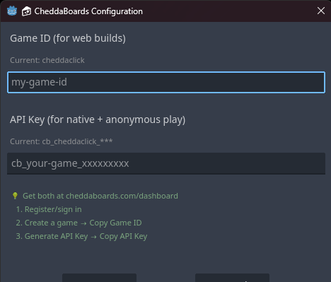

<p align="center">
  
</p>

# CheddaBoards Godot 4 Template

> **SDK Version:** 1.6.0 | [Changelog](docs/CHANGELOG.md)

<p align="center">
  
  
</p>

A complete game template with leaderboards, achievements, and authentication built in.

**Download → Add your game → Export. That's it.**

Zero servers. $0 for indie devs. Windows, Mac, Linux, Mobile.

---

## Current Status

| Platform | Status | Notes |
|----------|--------|-------|
| **Native (Windows/Mac/Linux)** | ✅ Stable | HTTP API mode |
| **Mobile** | ✅ Stable | HTTP API mode |
| **Web** | ✅ Stable | HTTP API mode (anonymous) |

> **Note:** OAuth (Google/Apple Sign-In) is temporarily disabled while we migrate to the REST API. Anonymous play works on all platforms.

---

## What's Included

| Scene | Description |
|-------|-------------|
| MainMenu | Four-panel auth flow with anonymous dashboard (v1.6.0) |
| Game | Example clicker game with levels & time extension |
| Leaderboard | Full leaderboard UI with time periods & archives |
| AchievementsView | Achievement list with progress |
| AchievementNotification | Popup system for unlocks |
| CheddaBoards SDK | Core backend integration |
| Achievements System | Backend-synced achievements with score-first submission |

---

## What's New in v1.6.0

### Anonymous Dashboard System
Returning anonymous players now get a personalized dashboard showing:
- Weekly score
- Games played count
- Quick access to achievements & leaderboard

### Score-First Achievement Submission
Achievements now sync silently in the background after score submission succeeds - no more blocking the game over flow.

---

## Features

### Platform Support

- **Native exports** - HTTP API for Windows, Mac, Linux, Mobile
- **Web exports** - HTTP API for anonymous play
- **Anonymous play** - No account required, instant play with device ID
- **Cross-platform** - Same codebase works everywhere

### Authentication Flow (v1.6.0)

The MainMenu now supports a four-panel authentication system:

| Panel | When Shown | Features |
|-------|------------|----------|
| **Login Panel** | First-time players | PLAY NOW, Leaderboard, (hidden) login buttons |
| **Name Entry** | Before first game | Custom nickname input |
| **Anonymous Dashboard** | Returning anonymous players | Stats, achievements, leaderboard access |
| **Main Panel** | Logged-in users | Full profile with all features |

```gdscript
# Automatic flow - no code needed!
# The MainMenu handles:
# - Device ID generation & persistence
# - Nickname saving to local file
# - Silent login for returning players
# - Profile polling with timeout/retry
```

### Anti-Cheat (v1.5.0+)

- **Play sessions** - Server-side time tracking
- **Score validation** - Rejects impossible scores based on play time
- **Rate limiting** - Prevents spam submissions
- **Score caps** - Block obviously fake values

### Authentication

| Method | Native | Web | Status |
|--------|--------|-----|--------|
| Anonymous / Device ID | ✅ | ✅ | **Working** |
| Chedda ID / Internet Identity | — | ⚠️ | Unstable |
| Google Sign-In | — | ❌ | Temporarily disabled |
| Apple Sign-In | — | ❌ | Temporarily disabled |

> **Recommended:** Use anonymous authentication for all platforms during the OAuth migration.

### Leaderboards

- Global leaderboard with rankings
- **Multiple scoreboards** - All Time, Weekly, Daily, Monthly
- **Timed competitions** - Auto-reset with archives
- **View past winners** - Last week's champion, hall of fame
- Sort by score or streak
- Custom nicknames for anonymous players
- Your entry highlighted

### Achievements (v1.6.0)

- Configurable achievement definitions
- **Score-first submission** - Score submits immediately, achievements sync silently
- **Deferred sync** - Failed achievements re-queue automatically
- **Session tracking** - Track damage taken, combos, special actions per run
- Automatic unlocking based on score/streak/games played
- **Level achievements** - Unlock for reaching game levels
- Popup notifications with batch support
- Offline support with local caching
- Works for anonymous players (local storage)

### Player Stats

- High score tracking
- Best streak tracking
- Games played count
- Cross-game player profiles

---

## Prerequisites

- **Godot 4.x** (tested on 4.3+)
- **CheddaBoards Account** - Free at [cheddaboards.com](https://cheddaboards.com)
- **Game ID** - Register your game on the dashboard
- **API Key** - For native/anonymous builds (get from dashboard)

---

## Quick Start

### How It Works

1. Download the template from Asset Library or GitHub
2. Open in Godot 4.x
3. Run Setup Wizard → Enter your Game ID & API key
4. Replace `Game.tscn` with your actual game
5. Export → Players get leaderboards & achievements!

### Native Export (Recommended)

1. Register your game at [cheddaboards.com](https://cheddaboards.com)
2. Get your API Key from the dashboard
3. Copy files to your project:
   - `addons/cheddaboards/` folder
4. Run Setup Wizard: `File → Run → SetupWizard.gd`
   - Or manually add Autoloads in Project Settings:
     - `CheddaBoards` → `addons/cheddaboards/CheddaBoards.gd`
     - `Achievements` → `addons/cheddaboards/Achievements.gd`
5. Set credentials in `CheddaBoards.gd` or at runtime:

```gdscript
var game_id: String = "your-game-id"
var api_key: String = "cb_your_api_key_here"

# Or at runtime:
CheddaBoards.set_api_key("cb_your_api_key_here")
```

### Web Export

Web exports work with anonymous authentication (HTTP API mode):

1. Copy `template.html` to your project root
2. Configure export: `Project → Export → Web → Custom HTML Shell: res://template.html`
3. Export as `index.html`
4. Test with local server: `python3 -m http.server 8000`

> **Note:** OAuth (Google/Apple/Chedda ID) is temporarily disabled. Use anonymous authentication for web builds.

---

## Integration Guide

### Basic Setup

```gdscript
extends Node

func _ready():
    # Wait for SDK
    await CheddaBoards.wait_until_ready()
    
    # Connect signals
    CheddaBoards.login_success.connect(_on_login)
    CheddaBoards.score_submitted.connect(_on_score_saved)
    CheddaBoards.score_error.connect(_on_score_error)

func _start_game():
    # Anonymous play works on ALL platforms
    CheddaBoards.login_anonymous("PlayerName")

func _on_login(nickname: String):
    print("Welcome, ", nickname)

func _on_game_over(score: int, streak: int):
    # Submit score WITH achievements (v1.6.0 score-first pattern)
    if Achievements:
        Achievements.increment_games_played()
        Achievements.check_game_over(score, 0, streak)
        Achievements.submit_with_score(score, streak)  # Score first, achievements async
    else:
        CheddaBoards.submit_score(score, streak)

func _on_score_saved(score: int, streak: int):
    print("Score saved: ", score)

func _on_score_error(reason: String):
    print("Error: ", reason)
```

### Anonymous Dashboard Flow (v1.6.0)

The MainMenu automatically handles returning anonymous players:

```gdscript
# In MainMenu.gd - this happens automatically:

func _check_existing_auth():
    # Check for returning anonymous player
    if _is_returning_anonymous_player():
        _show_anonymous_panel()  # Shows dashboard with stats
    else:
        _show_login_panel()  # Shows PLAY NOW for new players

func _is_returning_anonymous_player() -> bool:
    # Must have a nickname saved AND have played before
    return not anonymous_nickname.is_empty() and anonymous_has_played
```

### Score-First Achievement Submission (v1.6.0)

```gdscript
# Old pattern (blocking):
# Achievements.submit_with_score() would wait for achievement sync

# New pattern (non-blocking):
func submit_with_score(score: int, streak: int = 0):
    # 1. Submit score IMMEDIATELY
    CheddaBoards.submit_score(score, streak)
    
    # 2. Queue achievements for background sync
    for achievement_id in pending_notifications:
        deferred_achievements.append(achievement_id)
    
    # 3. After score succeeds, sync achievements silently
    # (handled by _on_score_submitted signal)
```

### Play Sessions (Anti-Cheat)

```gdscript
func _start_game():
    # Start a timed session when gameplay begins
    if CheddaBoards.is_ready():
        CheddaBoards.start_play_session()

func _on_score_submitted(score: int, streak: int):
    # Clear session after successful submit
    CheddaBoards.clear_play_session()
```

### Session Tracking for Achievements (v1.6.0)

```gdscript
# Start of each game/run
Achievements.start_new_session()

# During gameplay
Achievements.on_damage_taken()  # Track if player took damage
Achievements.on_special_action("dash")  # Track special moves

# At game over - check session-based achievements
if not Achievements.session_damage_taken:
    Achievements.unlock("no_damage")  # Perfect run!

if Achievements.session_max_combo >= 50:
    Achievements.unlock("combo_master")
```

---

## Configuration

### Game ID & API Key

Set in `CheddaBoards.gd`:

```gdscript
var game_id: String = "your-game-id"
var api_key: String = "cb_your_api_key_here"
```

Or at runtime:

```gdscript
func _ready():
    CheddaBoards.set_api_key("cb_your_api_key_here")
```

### Scoreboard Configuration

In `Leaderboard.gd`, set your scoreboard IDs:

```gdscript
const SCOREBOARD_ALL_TIME: String = "all-time"
const SCOREBOARD_WEEKLY: String = "weekly"
```

---

## Signals Reference

### CheddaBoards.gd

```gdscript
# Initialization
signal sdk_ready()
signal init_error(reason: String)

# Authentication
signal login_success(nickname: String)
signal login_failed(reason: String)
signal login_timeout()
signal logout_success()

# Profile
signal profile_loaded(nickname: String, score: int, streak: int, achievements: Array)
signal no_profile()
signal nickname_changed(new_nickname: String)
signal nickname_error(reason: String)

# Scores
signal score_submitted(score: int, streak: int)
signal score_error(reason: String)

# Leaderboards
signal leaderboard_loaded(entries: Array)
signal player_rank_loaded(rank: int, score: int, streak: int, total_players: int)
signal rank_error(reason: String)

# Scoreboards
signal scoreboard_loaded(scoreboard_id: String, config: Dictionary, entries: Array)
signal scoreboard_rank_loaded(scoreboard_id: String, rank: int, score: int, streak: int, total: int)
signal scoreboard_error(reason: String)

# Archives
signal archives_list_loaded(scoreboard_id: String, archives: Array)
signal archived_scoreboard_loaded(archive_id: String, config: Dictionary, entries: Array)
signal archive_error(reason: String)

# Play Sessions
signal play_session_started(token: String)
signal play_session_error(reason: String)

# HTTP API
signal request_failed(endpoint: String, error: String)
```

### Achievements.gd (v1.6.0)

```gdscript
signal achievement_unlocked(achievement_id: String, achievement_name: String)
signal progress_updated(achievement_id: String, current: int, total: int)
signal achievements_synced()
signal achievements_ready()
signal submission_complete(success: bool)  # New in v1.6.0
```

---

## Debugging

### Debug Shortcuts

| Key | Action |
|-----|--------|
| F6 | Submit 5 random test scores |
| F7 | Submit 1 random test score |
| F8 | Force profile refresh |
| F9 | Debug status dump |

### Common Issues

| Issue | Solution |
|-------|----------|
| "API key not set" | Set `api_key` in CheddaBoards.gd or call `set_api_key()` |
| "Game ID not set" | Set `game_id` in CheddaBoards.gd or run Setup Wizard |
| "CheddaBoards not ready" | Use `await CheddaBoards.wait_until_ready()` |
| Score not submitting | Check `is_authenticated()` and connect to `score_error` |
| OAuth not working | OAuth temporarily disabled - use anonymous auth |
| Web blank screen | Use local server, not `file://`. Export must be `index.html` |

---

## Template Structure

```
CheddaBoards-Godot/
├── addons/
│   └── cheddaboards/
│       ├── CheddaBoards.gd       # Core SDK (Autoload) v1.5.7
│       ├── Achievements.gd       # Achievement system (Autoload) v1.5.0
│       ├── SetupWizard.gd        # Setup & validation tool
│       └── icon.png
├── scenes/
│   ├── MainMenu.tscn/.gd         # Four-panel auth flow (v1.5.0)
│   ├── Game.tscn/.gd             # Example game with levels
│   ├── Leaderboard.tscn/.gd      # Leaderboard with archives (v1.5.0)
│   ├── AchievementsView.tscn/.gd # Achievement list
│   └── AchievementNotification.* # Unlock popups
├── assets/                       # Sprites, fonts, etc.
├── template.html                 # Web export template
├── project.godot                 # Pre-configured project
├── docs/
│   └── CHANGELOG.md
└── README.md
```

---

## Version History

| Version | Date | Changes |
|---------|------|---------|
| **v1.6.0** | **2026-01-16** | **Anonymous dashboard, score-first achievements, OAuth paused** |
| v1.5.0 | 2026-01-14 | Play session anti-cheat, time validation |
| v1.4.0 | 2026-01-04 | OAuth in Setup Wizard, nickname/score/player ID fixes |
| v1.3.0 | 2025-12-30 | Timed scoreboards, archives, level system, debug shortcuts |
| v1.2.2 | 2025-12-27 | Unique default nicknames |
| v1.2.1 | 2025-12-18 | Native HTTP API support, anonymous login, API key auth |
| v1.2.0 | 2025-12-15 | Anonymous play with device ID |
| v1.1.0 | 2025-12-03 | Setup Wizard, Asset Library structure |
| v1.0.0 | 2025-11-02 | Initial release - Web only |

---

## Roadmap

- [ ] Complete OAuth migration to REST API
- [ ] Restore Google/Apple Sign-In
- [ ] Stabilize web exports
- [ ] Unity SDK
- [ ] Unreal SDK

---

## License

MIT License - Use freely in your games!

---

**Built with 🧀 by [CheddaTech](https://cheddatech.com)**
