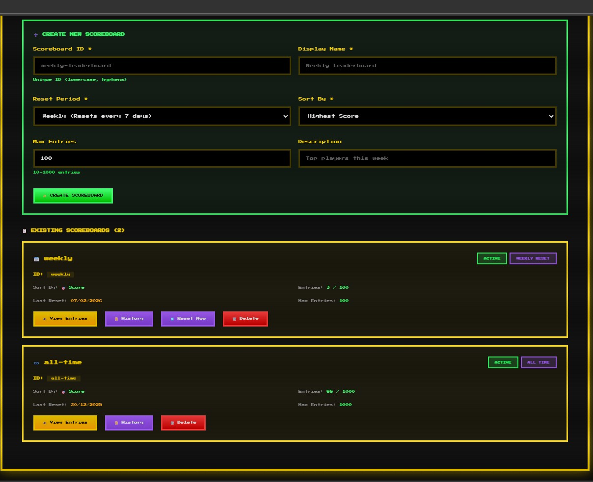
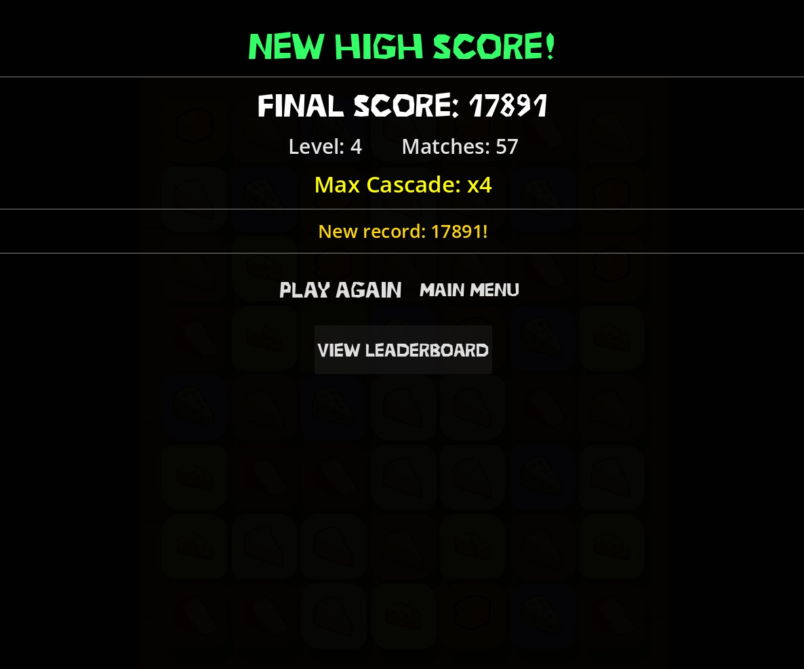
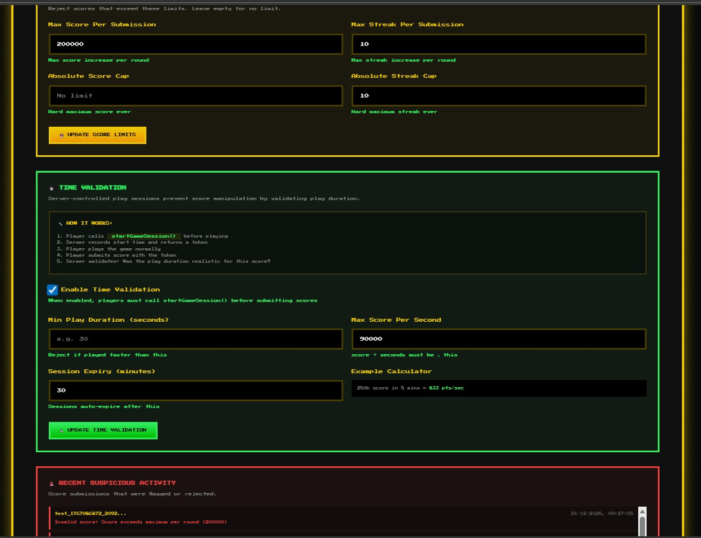
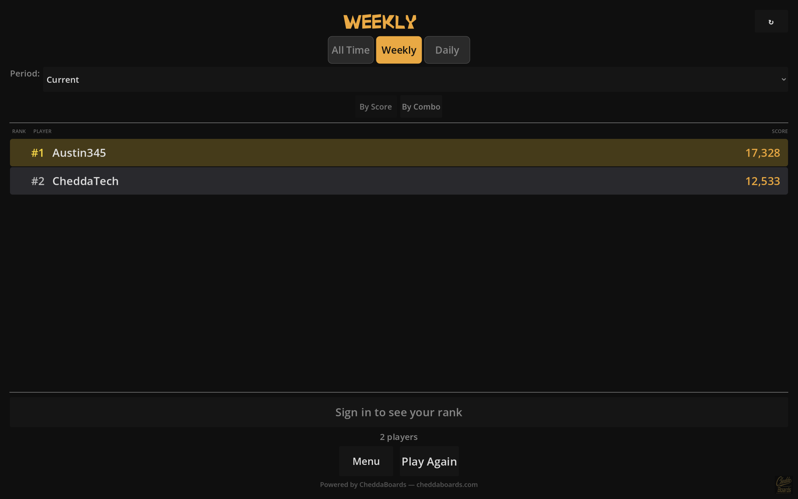
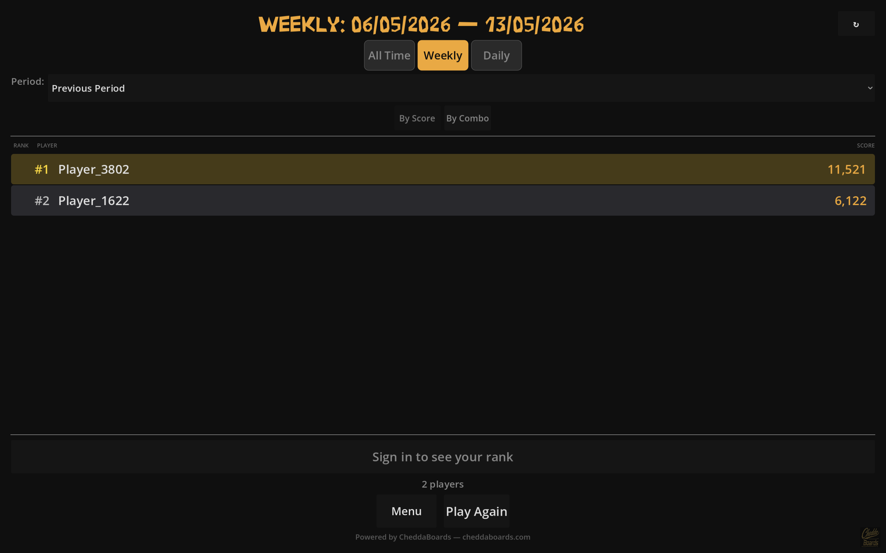
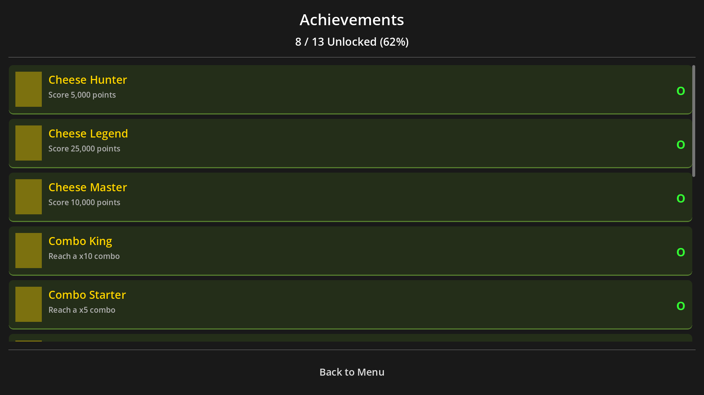
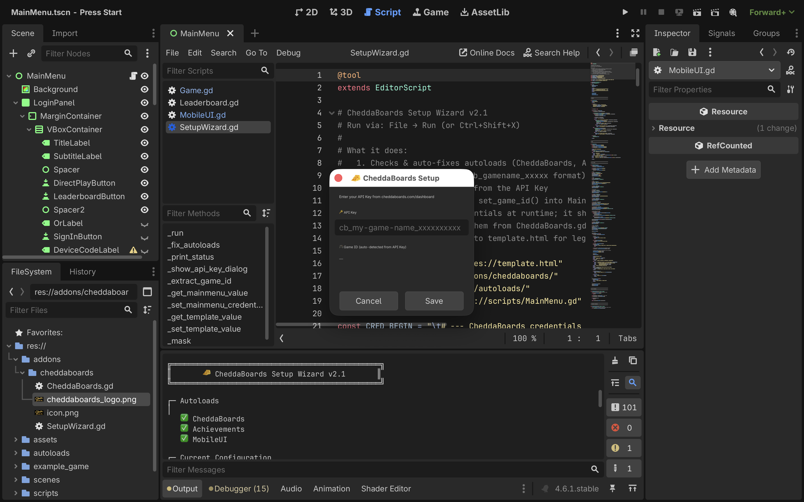

<p align="center">
  
</p>

# CheddaBoards Godot 4 Template

> **SDK Version:** 2.2.0 | [Changelog](docs/CHANGELOG.md)

<p align="center">
  
  
</p>

A complete game template with leaderboards, achievements, and authentication built in.

**Download → Add your game → Export. That's it.**

Free tier available. Windows, Mac, Linux, Mobile, Web.

Built on the [Internet Computer](https://internetcomputer.org) — distributed compute with transparent, predictable costs. No per-player fees, no surprise bills.

---

## Current Status

| Platform | Status | Notes |
|----------|--------|-------|
| **Native (Windows/Mac/Linux)** | ✅ Stable | HTTP API + Device Code Auth |
| **Mobile** | ✅ Stable | HTTP API + Device Code Auth |
| **Web** | ✅ Stable | HTTP API + Device Code Auth |

> **Note:** All platforms support Google/Apple Sign-In via Device Code Auth — no browser integration or OAuth SDKs needed in your game. Anonymous players can upgrade their account to a verified provider on any platform.

---

## What's Included

| Component | Description |
|-----------|-------------|
| **Game Wrapper** | Drop-in wrapper handles HUD, game over, score submission |
| **Example Game** | CheddaClick - clicker game with levels & combos |
| **MainMenu** | Four-panel auth flow with anonymous dashboard |
| **Leaderboard** | Full UI with time periods & archives |
| **AchievementsView** | Achievement list with progress |
| **AchievementNotification** | Popup system for unlocks |
| **CheddaBoards SDK** | Core backend integration |
| **Achievements System** | Backend-synced achievements |

---

## Quick Look

Five lines from a fresh project to a working leaderboard:

```gdscript
func _ready():
    CheddaBoards.set_api_key("cb_your-api-key")
    CheddaBoards.set_game_id("your-game-id")
    CheddaBoards.login_anonymous("PlayerName")

func _on_game_over(score: int, streak: int):
    CheddaBoards.submit_score(score, streak)
```

Profile, leaderboard rank, achievements, and anti-cheat all work without further setup. Drop in the `MainMenu` and `Leaderboard` scenes from this template and you've got a full UI as well.

---

## What's New in v2.x

### v2.2.0 — Polish & Privacy

- **`profile_loaded` now emits `play_count`** as the 5th argument. Existing handlers with a 4-arg signature must add a trailing `play_count: int` parameter — this is a breaking change. Update your `_on_profile_loaded` handler accordingly.
- **SDK keeps processing while the scene tree is paused** (`PROCESS_MODE_ALWAYS`). Fixes hung score submits when a game-over screen pauses the tree.
- **Debug logging defaults to OFF** — set `CheddaBoards.debug_logging = true` while developing.
- **Device codes and emails are redacted in log output** for privacy.
- **Focus-regain immediate polling** — when the user finishes signing in on their phone and returns to the game, the popup closes within ~100ms instead of waiting for the next scheduled poll.
- **Empty-nickname semantics** — anonymous players without a custom name keep an empty `_nickname` so UIs can show "Guest" instead of an auto-generated placeholder.
- **Non-fatal 404 on scoreboard lookups** — a scoreboard that isn't configured for the game is treated as a normal state, not an error.
- **Legacy method aliases** retained for backwards compatibility (e.g. `login_as_guest`, `get_profile`, `configure`).

### v2.1.0 — QR Codes

- `device_code_received` now emits a `qr_data_url` (base64 PNG) as a third argument.
- The QR code encodes the full verification URL with the code pre-filled, so players scan once and tap a single button instead of typing a 6-digit code.
- Falls back gracefully to the raw code if the API returns null.

### v2.0.0 — HTTP-Only SDK

- **Removed the JavaScript bridge / web SDK dependency** entirely.
- All platforms now use the same REST API paths — one codebase, no `OS.get_name() == "Web"` branching.
- Social login moved to **Device Code Auth** (works everywhere — Windows, Mac, Linux, Mobile, Web, consoles).

### How Device Code Auth Works

```
┌──────────────┐                    ┌──────────────────────┐
│  Your Game   │                    │  Player's Phone      │
│              │                    │                      │
│  "Scan QR or │                    │  cheddaboards.com/   │
│   go to      │                    │  link                │
│   cheddaboards                    │                      │
│   .com/link" │                    │  Enter: CHEDDA-7K3M  │
│              │                    │  [Google] [Apple]    │
│  "Enter code:│                    │                      │
│   CHEDDA-7K3M"│    polls every 5s │  ✅ Signed in!       │
│  ✅ Logged in!│◄──────────────────│                      │
└──────────────┘                    └──────────────────────┘
```

```gdscript
# In your game — no OAuth SDKs needed
CheddaBoards.login_with_device_code()

# Listen for the code/URL/QR to display
CheddaBoards.device_code_received.connect(func(user_code, verification_url, qr_data_url):
    show_label("Go to %s and enter: %s" % [verification_url, user_code])
    # qr_data_url is a base64 PNG you can decode into a TextureRect
    # (see scripts/DeviceCodeLogin.gd for a reference implementation)
)

# Login completes automatically via polling
CheddaBoards.device_code_approved.connect(func(nickname):
    print("Welcome, %s!" % nickname)
)
```

### Cross-Platform Account Linking

- Anonymous players can upgrade to Google/Apple via the same device code flow.
- All scores, achievements, and progress are preserved through migration.
- Available from both the in-game Sign In button and the Anonymous Dashboard.

---

## Features

### Platform Support

- **Native exports** — HTTP API for Windows, Mac, Linux, Mobile
- **Web exports** — HTTP API, same flow as native (no platform branching)
- **Anonymous play** — No account required, instant play with device ID
- **Device Code Auth** — Google/Apple Sign-In on any platform, no OAuth SDKs needed
- **Cross-platform** — Same codebase works everywhere
- **Account linking** — Upgrade anonymous accounts to Google/Apple from any platform

### Game Wrapper System (v1.7.0)

<p align="center">
  
</p>

The new modular architecture separates your game from CheddaBoards integration:

| Component | What It Does |
|-----------|--------------|
| **Game.gd (Wrapper)** | HUD, game over panel, score submission, achievements |
| **Your Game** | Just gameplay - emit signals for score/stats/game over |

```gdscript
# Your game just needs these 4 signals:
signal score_changed(score: int, combo: int)
signal stats_changed(hits: int, misses: int, level: int)
signal time_changed(time_remaining: float, max_time: float)
signal game_over(final_score: int, stats: Dictionary)

# Emit them when things happen:
score_changed.emit(current_score, combo_multiplier)
game_over.emit(final_score, {"hits": 50, "accuracy": 85, "max_combo": 8, "level": 3})
```

### Authentication Flow

The MainMenu supports a four-panel authentication system:

| Panel | When Shown | Features |
|-------|------------|----------|
| **Login Panel** | First-time players | PLAY NOW, Leaderboard, login buttons |
| **Name Entry** | Before first game | Custom nickname input |
| **Anonymous Dashboard** | Returning anonymous players | Stats, achievements, **upgrade to Google/Apple** |
| **Main Panel** | Logged-in users | Full profile with all features |

### Anti-Cheat

<p align="center">
  
</p>

Built-in server-side protection — no code required. Configure limits from your dashboard and CheddaBoards enforces them automatically.

| Protection | How It Works |
|------------|-------------|
| **Play Sessions** | Server tracks real play time — scores without a valid session are rejected |
| **Score Validation** | Backend calculates max possible score based on elapsed time |
| **Rate Limiting** | Blocks rapid-fire score submissions from bots or scripts |
| **Score Caps** | Set max score/streak per submission and absolute lifetime caps |

Set your limits based on your game's mechanics (e.g. max 200,000 points per round, max streak of 10), then tighten based on real player data. See your game's Security tab on the dashboard.

### Authentication

| Method | Native | Mobile | Web | Status |
|--------|--------|--------|-----|--------|
| Anonymous / Device ID | ✅ | ✅ | ✅ | **Working** |
| Google Sign-In (Device Code) | ✅ | ✅ | ✅ | **Working** |
| Apple Sign-In (Device Code) | ✅ | ✅ | ✅ | **Working** |
| Account Upgrade (Anon → Google/Apple) | ✅ | ✅ | ✅ | **Working** |

> **Device Code Auth:** Works on every platform. The game displays a QR code, URL, and short code; the player signs in on their phone browser, and the game picks up the session automatically. No OAuth SDKs, no browser popups, no platform-specific code. Anonymous players can also upgrade their account to Google/Apple from any platform, preserving all progress.

### Leaderboards

<p align="center">
  
  
</p>

- Global leaderboard with rankings
- Sort by score or streak
- Custom nicknames for anonymous players
- Your entry highlighted

### Timed Scoreboards

<p align="center">
  
</p>

Run weekly, daily, or monthly competitions that reset and archive automatically — zero maintenance.

| Type | Resets | Archives Kept | Use Case |
|------|--------|---------------|----------|
| **All-Time** | Never | — | Career high scores |
| **Weekly** | Every Monday | 52 | Weekly competitions |
| **Daily** | Every midnight | 90 | Daily challenges |
| **Monthly** | 1st of month | 12 | Monthly tournaments |

- Create scoreboards from the dashboard — no code changes needed
- Previous periods archived automatically with full leaderboard data
- Built-in UI shows "Current" vs "Last Week" toggle
- Winner highlighted with crown in archive view
- Hall of fame across multiple archived periods

> 📖 **Full guide:** [TIMED_LEADERBOARDS.md](docs/TIMED_LEADERBOARDS.md)

### Achievements

<p align="center">
  
</p>

- Configurable achievement definitions
- **Score-first submission** - Score submits immediately, achievements sync silently
- **Deferred sync** - Failed achievements re-queue automatically
- **Session tracking** - Track combos, levels, special actions per run
- Automatic unlocking based on score/streak/games played
- **Level achievements** - Unlock for reaching game levels
- Popup notifications with batch support
- Offline support with local caching
- Works for anonymous players (local storage)

---

## Prerequisites

- **Godot 4.x** (tested on 4.3+)
- **CheddaBoards Account** - Free at [cheddaboards.com](https://cheddaboards.com)
- **Game ID** - Register your game on the dashboard
- **API Key** - For native/anonymous builds (get from dashboard)

---

## Quick Start

### 1. Setup

<p align="center">
  
</p>

1. Download the template from the [Godot Asset Library](https://godotengine.org/asset-library/asset/4574) or [GitHub](https://github.com/cheddatech/CheddaBoards-Godot)
2. Open in Godot 4.x
3. Run Setup Wizard: `File → Run → addons/cheddaboards/SetupWizard.gd`
4. Enter your Game ID & API key from [cheddaboards.com](https://cheddaboards.com)

### 2. Add Your Game

1. Create your game scene (e.g., `example_game/MyGame.tscn`)
2. Add the 4 required signals to your game script
3. Emit signals when score/stats change and game ends
4. Set `game_scene_path` in `scenes/Game.tscn` to your game
5. Export → Players get leaderboards & achievements!

### 3. Required Signals

```gdscript
extends Control

# Required signals - GameWrapper listens to these
signal score_changed(score: int, combo: int)
signal stats_changed(hits: int, misses: int, level: int)
signal time_changed(time_remaining: float, max_time: float)
signal game_over(final_score: int, stats: Dictionary)

func _on_player_scored(points: int):
    current_score += points
    score_changed.emit(current_score, combo_multiplier)

func _on_game_ended():
    game_over.emit(current_score, {
        "hits": total_hits,
        "misses": total_misses,
        "max_combo": max_combo,
        "level": current_level,
        "accuracy": calculate_accuracy()
    })
```

### 4. Optional: Quick Restart

Add a `restart()` method for fast restarts without scene reload:

```gdscript
func restart():
    current_score = 0
    time_remaining = 30.0
    _start_game()
```

---

## Template Structure

```
CheddaBoards-Godot/
├── addons/
│   └── cheddaboards/
│       ├── CheddaBoards.gd       # Core SDK (Autoload)
│       ├── SetupWizard.gd        # Setup & validation tool
│       ├── cheddaboards_logo.png
│       └── icon.png
├── autoloads/
│   ├── Achievements.gd           # Achievement system (Autoload)
│   └── MobileUI.gd               # Mobile scaling (Autoload)
├── scenes/
│   ├── Game.tscn                 # Game wrapper (loads your game)
│   ├── MainMenu.tscn             # Four-panel auth flow
│   ├── Leaderboard.tscn          # Leaderboard with archives
│   ├── AchievementsView.tscn     # Achievement list
│   ├── AchievementNotification.tscn
│   └── DeviceCodeLogin.tscn      # Device code auth UI
├── scripts/
│   ├── Game.gd                   # Game wrapper logic
│   ├── MainMenu.gd               # Menu logic
│   ├── Leaderboard.gd            # Leaderboard logic
│   ├── AchievementsView.gd       # Achievement list logic
│   ├── AchievementNotification.gd
│   └── DeviceCodeLogin.gd        # Device code auth flow
├── example_game/
│   ├── CheddaClickGame.tscn      # Example clicker game
│   ├── CheddaClickGame.gd        # Example game logic
│   └── cheese.png                # Game assets
├── assets/
│   └── fonts/
│       └── ZeroCool.ttf
├── themes/
│   └── Buttons.tres
├── screenshots/
│   ├── screenshot1.png
│   ├── screenshot2.png
│   ├── screenshot_achievements.png
│   ├── screenshot_anticheat.png
│   ├── screenshot_gameover.png
│   ├── screenshot_leaderboard_alltime.png
│   ├── screenshot_leaderboard_archive.png
│   ├── screenshot_leaderboard_weekly.png
│   └── screenshot_setup_wizard.png
├── docs/
│   ├── API_QUICKSTART.md
│   ├── CHANGELOG.md
│   ├── QUICKSTART.md
│   ├── SETUP.md
│   ├── TIMED_LEADERBOARDS.md
│   └── TROUBLESHOOTING.md
├── template.html                 # Web export template
├── project.godot                 # Pre-configured project
├── favicon.ico
├── LICENSE
└── README.md
```

---

## Autoload Setup

The Setup Wizard configures these automatically, or set manually:

| Name | Path |
|------|------|
| CheddaBoards | `res://addons/cheddaboards/CheddaBoards.gd` |
| Achievements | `res://autoloads/Achievements.gd` |
| MobileUI | `res://autoloads/MobileUI.gd` |

---

## Configuration

### Game ID & API Key

As of SDK v2.2.0, the SDK ships with empty credential defaults. Set them at runtime before any other CheddaBoards call — the template's `MainMenu._ready()` is a good place:

```gdscript
func _ready():
    CheddaBoards.set_api_key("cb_your-game_xxxxxxxxxx")
    CheddaBoards.set_game_id("your-game-id")
    # ... rest of your setup
```

Get your credentials from the developer dashboard at [cheddaboards.com](https://cheddaboards.com). The Setup Wizard can also set these for you.

### Game Scene Path

In `scenes/Game.tscn`, set the exported variable:

```gdscript
@export var game_scene_path: String = "res://example_game/CheddaClickGame.tscn"
```

### Scoreboard Configuration

In `scripts/Leaderboard.gd`:

```gdscript
const SCOREBOARD_ALL_TIME: String = "all-time"
const SCOREBOARD_WEEKLY: String = "weekly"
```

---

## Signals Reference

### CheddaBoards.gd

The SDK exposes 34 signals across nine categories. All are typed in Godot 4.x.

#### Initialization

```gdscript
signal sdk_ready()
signal init_error(reason: String)
```

#### Authentication

```gdscript
signal login_success(nickname: String)
signal login_failed(reason: String)
signal logout_success()
signal auth_error(reason: String)
```

#### Profile

```gdscript
# v2.2.0: play_count added as 5th arg.
# 4-arg handlers from older versions must add a trailing play_count: int.
signal profile_loaded(nickname: String, score: int, streak: int, achievements: Array, play_count: int)
signal no_profile()
signal nickname_changed(new_nickname: String)
signal nickname_error(reason: String)
```

#### Scores & Legacy Leaderboard

```gdscript
signal score_submitted(score: int, streak: int)
signal score_error(reason: String)
signal leaderboard_loaded(entries: Array)
signal player_rank_loaded(rank: int, score: int, streak: int, total_players: int)
signal rank_error(reason: String)
```

#### Scoreboards (Time-based)

```gdscript
signal scoreboards_loaded(scoreboards: Array)
signal scoreboard_loaded(scoreboard_id: String, config: Dictionary, entries: Array)
signal scoreboard_rank_loaded(scoreboard_id: String, rank: int, score: int, streak: int, total: int)
signal scoreboard_error(reason: String)
```

#### Scoreboard Archives

```gdscript
signal archives_list_loaded(scoreboard_id: String, archives: Array)
signal archived_scoreboard_loaded(archive_id: String, config: Dictionary, entries: Array)
signal archive_stats_loaded(total_archives: int, by_scoreboard: Array)
signal archive_error(reason: String)
```

#### Achievements

```gdscript
signal achievement_unlocked(achievement_id: String)
signal achievements_loaded(achievements: Array)
```

#### Play Sessions (Anti-Cheat)

```gdscript
signal play_session_started(token: String)
signal play_session_error(reason: String)
```

#### Account Upgrade (Anonymous → Verified)

```gdscript
signal account_upgraded(profile: Dictionary, migration: Dictionary)
signal account_upgrade_failed(reason: String)
```

#### Device Code Auth

```gdscript
# qr_data_url is a base64 PNG of a QR encoding the full verification URL
# with the code pre-filled. Decode and apply to a TextureRect for scanning.
signal device_code_received(user_code: String, verification_url: String, qr_data_url: String)
signal device_code_approved(nickname: String)
signal device_code_expired()
signal device_code_error(reason: String)
```

#### HTTP (catch-all)

```gdscript
signal request_failed(endpoint: String, error: String)
```

### Achievements.gd

```gdscript
signal achievement_unlocked(achievement_id: String, achievement_name: String)
signal achievements_ready()
```

### Your Game (required)

```gdscript
signal score_changed(score: int, combo: int)
signal stats_changed(hits: int, misses: int, level: int)
signal time_changed(time_remaining: float, max_time: float)
signal game_over(final_score: int, stats: Dictionary)
```

---

## Debugging

### Common Issues

| Issue | Solution |
|-------|----------|
| "API key not set" | Call `CheddaBoards.set_api_key(...)` in your MainMenu's `_ready()` (SDK v2.2.0 ships with empty defaults), or run Setup Wizard |
| "Game ID not set" | Call `CheddaBoards.set_game_id(...)` in your MainMenu's `_ready()`, or run Setup Wizard |
| 4-arg `_on_profile_loaded` errors | v2.2.0 added `play_count` as 5th arg — add a trailing `play_count: int` parameter |
| Score submit hangs on pause screen | SDK v2.2.0+ keeps processing while the tree is paused — make sure you're on v2.2.0 or later |
| Game not loading | Check `game_scene_path` points to correct .tscn file |
| Script not found | Ensure .tscn files reference scripts in `scripts/` folder |
| Score not submitting | Check `is_authenticated()` and connect to `score_error` |
| Web blank screen | Use local server, not `file://`. Export as `index.html` |

---

## Migrating

### From v2.1.x and earlier → v2.2.0

The only breaking change is `profile_loaded` gaining `play_count` as its 5th argument. If your handler still has the 4-arg signature, the signal won't connect and the profile UI won't update.

```gdscript
# Before (v2.1.x and earlier)
func _on_profile_loaded(nickname, score, streak, achievements):
    ...

# After (v2.2.0+)
func _on_profile_loaded(nickname, score, streak, achievements, play_count):
    ...
```

Credentials also moved out of `CheddaBoards.gd` defaults — call `set_api_key()` and `set_game_id()` in your menu's `_ready()` if you weren't already.

---

## Version History

| Version | Date | Changes |
|---------|------|---------|
| v2.2.0 | 2026-05-31 | `profile_loaded` adds `play_count` (breaking), pause-safe HTTP, legacy method aliases |
| v2.1.0 | 2026-05 | QR code support — `device_code_received` adds `qr_data_url` |
| v2.0.0 | 2026-04 | HTTP-only SDK — removed JS bridge, device code auth on all platforms |
| v1.9.0 | 2026-02-23 | Device Code Auth (cross-platform Google/Apple), account linking on all platforms |
| v1.7.0 | 2026-02-05 | Modular GameWrapper, account upgrade (web), clean folder structure |
| v1.6.0 | 2026-01-16 | Anonymous dashboard, score-first achievements |
| v1.5.0 | 2026-01-14 | Play session anti-cheat, time validation |
| v1.4.0 | 2026-01-04 | OAuth in Setup Wizard, nickname fixes |
| v1.3.0 | 2025-12-30 | Timed scoreboards, archives, level system |
| v1.2.0 | 2025-12-15 | Anonymous play with device ID |
| v1.1.0 | 2025-12-03 | Setup Wizard, Asset Library structure |
| v1.0.0 | 2025-11-02 | Initial release |

---

## Roadmap

- [ ] Godot 3.6 SDK release on GitHub
- [ ] Unity SDK (in progress)
- [ ] Expanded analytics dashboard

---

## Support & Community

- **Bug reports & feature requests:** [GitHub Issues](https://github.com/cheddatech/CheddaBoards-Godot/issues)
- **Player & developer info:** [cheddaboards.com](https://cheddaboards.com)
- **Studio:** [cheddatech.com](https://cheddatech.com)
- **Support development:** [Buy me a coffee](https://buymeacoffee.com/CheddaTech) — no VC, no investors, built by a solo founder for indie devs

---

## License

MIT License - Use freely in your games!

---

[cheddatech.com](https://cheddatech.com)
