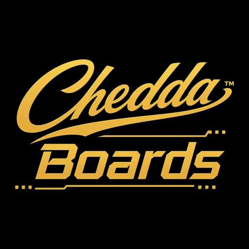
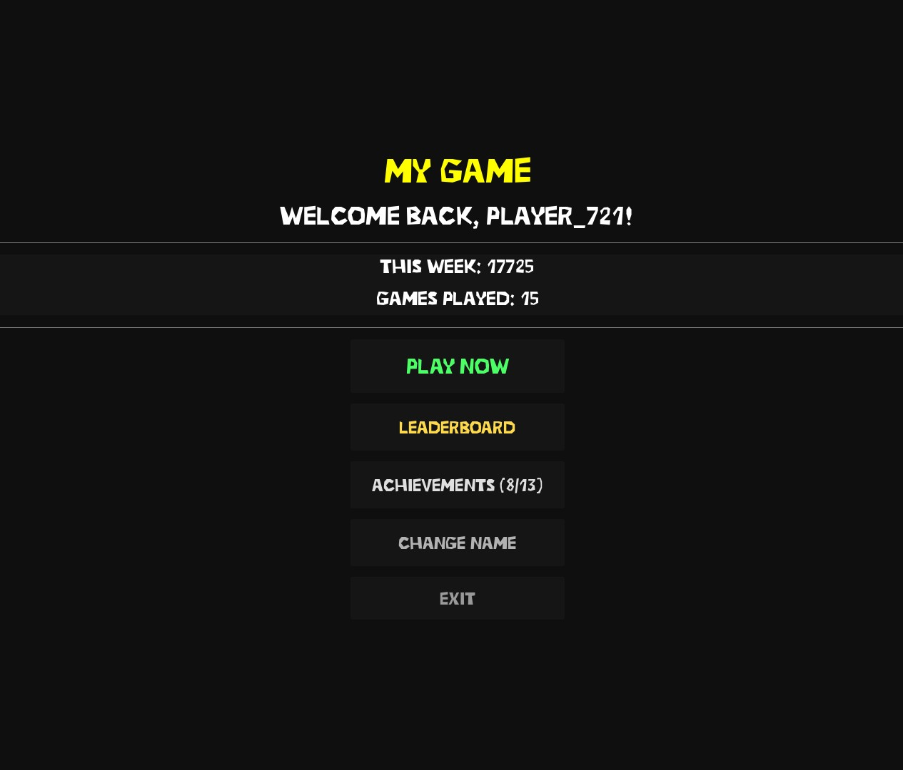
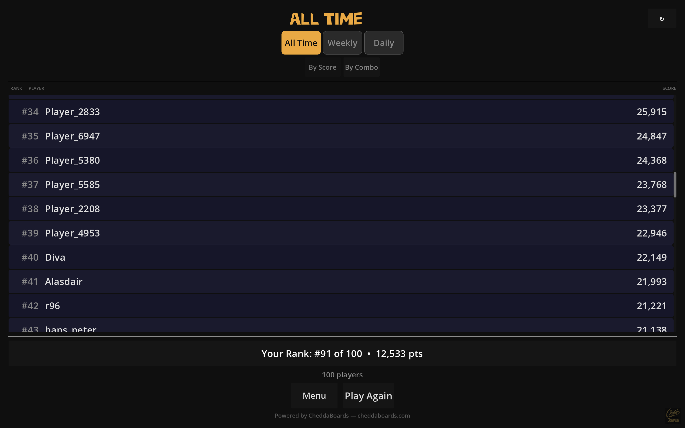

<p align="center">
  
</p>

# CheddaBoards — Godot 4 Template

**A complete game template with leaderboards, achievements, and cross-platform auth built in.**
**Download → Add your game → Export. That's it.**

> **SDK 2.2.0** · Godot 4.6+ · Windows / Mac / Linux / Mobile / Web · MIT · Free tier · [Changelog](docs/CHANGELOG.md)

<p align="center">
  
  
</p>

Free tier. No per-player fees, no surprise bills. Battle-tested in production by the studio's own arcade games.

---

## Choose your path

This repo is a full **template** — most people should just start with the [Quick Start](#quick-start) below. If that's not you, the [`docs/`](docs/README.md) folder has the other routes:

| You have… | Best route | Time |
|-----------|------------|------|
| A fresh project, or you want the full UI out of the box | **Template** — keep reading, start at [Quick Start](#quick-start) | ~3 min |
| A game you've already built | **[Drop-in SDK](docs/quickstart-dropin.md)** — just the SDK, your own UI | ~10 min |
| A non-Godot engine, or you want raw control | **[REST API](docs/quickstart-api.md)** | varies |

> 📚 Full documentation index: **[docs/README.md](docs/README.md)**

---

## Quick Look

The template already ships with login, a leaderboard, achievements, and anti-cheat wired up. To plug in **your** game, you emit **one signal** when a run ends:

```gdscript
# In your own game scene
signal game_over(final_score: int, stats: Dictionary)

func _on_run_finished():
    game_over.emit(final_score, {
        "hits": total_hits,
        "max_combo": max_combo,
        "level": current_level,
        "accuracy": accuracy_percent,
    })
```

Point the wrapper at your scene and that's the whole game-side integration — the wrapper shows the game-over screen, submits the score, syncs achievements, and runs the anti-cheat play session for you.

> Of that dict, only `final_score` and `max_combo` reach the leaderboard — saved as the player's **score** and **streak**. The rest (`hits`, `level`, `accuracy`) just feed the game-over screen and achievements. If your game's streak isn't a combo, that's the value to put in `max_combo`. → [What CheddaBoards stores](docs/guides/data-model.md)

> That free tier is possible because CheddaBoards runs on the [Internet Computer](https://internetcomputer.org) — predictable infrastructure costs, so there's no per-player billing to pass on to you.

---

## What's included

| Component | Description |
|-----------|-------------|
| **Game Wrapper** | Drop-in wrapper handles HUD, game over, score submission, achievements, and play sessions |
| **Example Game** | CheddaClick — a clicker game with levels & combos |
| **MainMenu** | Four-panel auth flow with anonymous dashboard |
| **Leaderboard** | Full UI with time periods & archives |
| **Achievements** | Backend-synced, with popup notifications & offline cache |
| **CheddaBoards SDK** | Core backend integration (also usable standalone) |

**Status:** Native, Mobile, and Web are all ✅ stable. Every platform supports Google / Apple sign-in via Device Code Auth — no OAuth SDKs in your game. → [Device Code Login](docs/guides/device-code-login.md)

---

## Quick Start

> 🆕 **New to Godot?** Follow the step-by-step **[Getting Started guide](docs/guides/getting-started.md)** instead — it assumes zero Godot experience and walks you from install to a score on the board. The three steps below are the fast version for people who already know Godot.

### 1. Setup

Download from the [Asset Library](https://godotengine.org/asset-library/asset/4574) or GitHub, open in **Godot 4.6+**, then run the Setup Wizard:

```
File → Run → addons/cheddaboards/SetupWizard.gd
```

Enter your **API key** from [cheddaboards.com](https://cheddaboards.com) — the wizard reads your Game ID from it automatically. It also registers the autoloads (`CheddaBoards`, `Achievements`, `MobileUI`).

### 2. Add your game

The template runs the example game (**CheddaClick**) out of the box — here's how to swap in your own. Your game lives in its **own scene** (any root node — `Node2D`, `Control`, whatever your game needs). The wrapper loads it as a child and listens for its signals. You only have to emit **one**.

> 📖 Step-by-step version, with a complete example game and how to remove CheddaClick: **[Build Your Own Game](docs/guides/your-own-game.md)**

**Required — emit `game_over` when a run ends.** This is the only signal the wrapper needs:

```gdscript
extends Node2D  # your game's root — any node type is fine

# The ONE signal the wrapper requires.
signal game_over(final_score: int, stats: Dictionary)

func end_run():
    game_over.emit(score, {
        "hits": hits,          # every key is optional — include a key to show its
        "misses": misses,      # game-over field, omit it to hide it
        "max_combo": max_combo,
        "level": level,
        "accuracy": accuracy,  # 0–100
    })
```

The wrapper takes it from there: shows the game-over screen, submits the score, checks achievements, and closes the anti-cheat session.

**Optional — feed the built-in HUD live.** Add these *only* if you're using the template's HUD. Each panel appears only if your scene declares its signal — the ones you don't feed simply don't show:

```gdscript
signal score_changed(score: int, combo: int)               # live score/combo + mid-game achievement pops
signal stats_changed(hits: int, misses: int, level: int)   # level + misses readout
signal time_changed(time_remaining: float, max_time: float) # countdown timer

# …then emit them as those values change during play:
score_changed.emit(score, combo)
stats_changed.emit(hits, misses, level)
time_changed.emit(time_left, round_length)
```

> Without `score_changed`, score/combo achievements still unlock — they're just evaluated once at game-over instead of live during the run.

**Optional — Play Again & pause.** If your game can reset itself in place, add a `restart()` method and the wrapper calls it instead of reloading the whole scene:

```gdscript
func restart():
    # reset your game state back to the start
    pass

func pause():    # optional — called if you wire up pause support
    pass
func unpause():  # optional
    pass
```

**Point the wrapper at your scene.** Select the `Game` node in `scenes/Game.tscn` and set **Game Scene Path** in the Inspector to your scene — or change the default in the wrapper script:

```gdscript
@export var game_scene_path: String = "res://your_game/YourGame.tscn"
```

### 3. Export

Players get leaderboards, achievements, and anti-cheat — no further wiring.

> 📖 Detailed setup, web export & OAuth specifics: **[SETUP.md](docs/SETUP.md)**

---

## Features at a glance

| Feature | Learn more |
|---------|------------|
| Cross-platform auth — anonymous, Google / Apple via device code, account linking | [Authentication](docs/guides/authentication.md) · [Device Code Login](docs/guides/device-code-login.md) |
| Global leaderboards (sort by score or streak, player rank highlighted) | [Drop-in Quickstart](docs/quickstart-dropin.md) |
| Timed scoreboards — weekly / daily / monthly, auto-reset & archive | [Timed Leaderboards](docs/guides/timed-leaderboards.md) |
| Achievements — auto-unlock, offline cache, deferred sync, popups | [Achievements](docs/guides/achievements.md) |
| Anti-cheat — server-side play sessions, score validation, configurable caps | [Anti-cheat](docs/guides/anti-cheat.md) |
| Fully typed signal API across the SDK | [Signals Reference](docs/guides/signals-reference.md) |

---

## Project structure

```
CheddaBoards-Godot/
├── addons/cheddaboards/      # Core SDK + Setup Wizard (autoload)
├── autoloads/                # Achievements, MobileUI (autoloads)
├── scenes/                   # Game wrapper, MainMenu, Leaderboard, Achievements, DeviceCodeLogin
├── scripts/                  # Logic for the scenes above
├── example_game/             # CheddaClick — the example game
├── assets/fonts/
├── screenshots/
├── docs/                     # Full documentation (see docs/README.md)
│   ├── README.md             # Docs index / router
│   ├── SETUP.md
│   ├── quickstart-dropin.md
│   ├── quickstart-api.md
│   ├── CHANGELOG.md
│   ├── TROUBLESHOOTING.md
│   └── guides/
│       ├── getting-started.md     # New to Godot — install to first score
│       ├── your-own-game.md       # Replace CheddaClick with your game
│       ├── data-model.md          # What CheddaBoards stores
│       ├── authentication.md
│       ├── device-code-login.md
│       ├── achievements.md
│       ├── anti-cheat.md
│       ├── timed-leaderboards.md
│       ├── web-export.md
│       └── signals-reference.md
├── template.html             # Web export template
├── project.godot
└── README.md
```

---

## Prerequisites

- **Godot 4.6+**
- A free **CheddaBoards account** — [cheddaboards.com](https://cheddaboards.com) — for your Game ID & API key

> **Heads up (v2.2.0):** `profile_loaded` now emits `play_count` as a 5th argument — a breaking change for 4-arg handlers. Full migration notes in the [Changelog](docs/CHANGELOG.md).

---

## Roadmap

- [ ] Godot 3.6 SDK release
- [ ] Unity SDK (in progress)
- [ ] Expanded analytics dashboard

---

## Support

- **Bugs & feature requests:** [GitHub Issues](https://github.com/cheddatech/CheddaBoards-Godot/issues)
- **Player & developer info:** [cheddaboards.com](https://cheddaboards.com)
- **Studio:** [cheddatech.com](https://cheddatech.com)
- **Support development:** [Buy me a coffee](https://buymeacoffee.com/CheddaTech) — no VC, no investors, built by a solo founder for indie devs

MIT License — use freely in your games.
