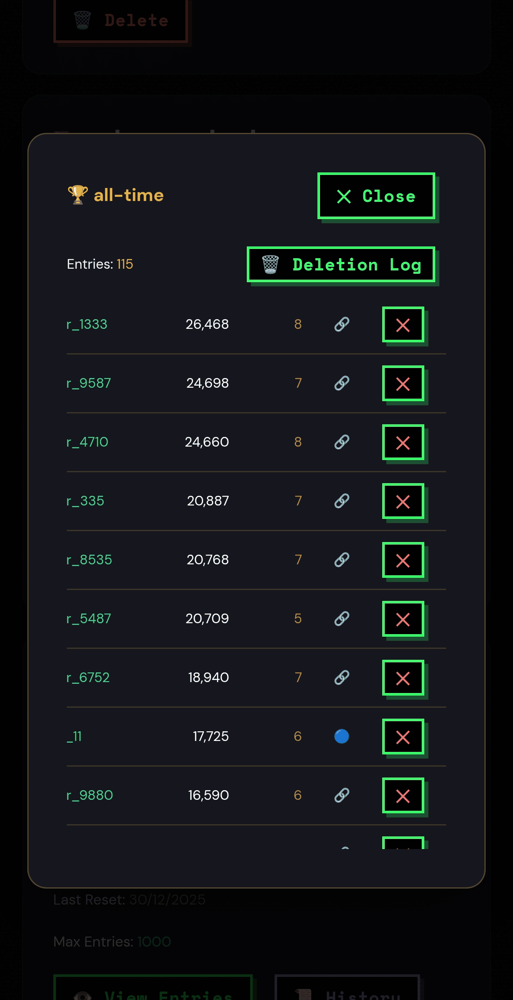
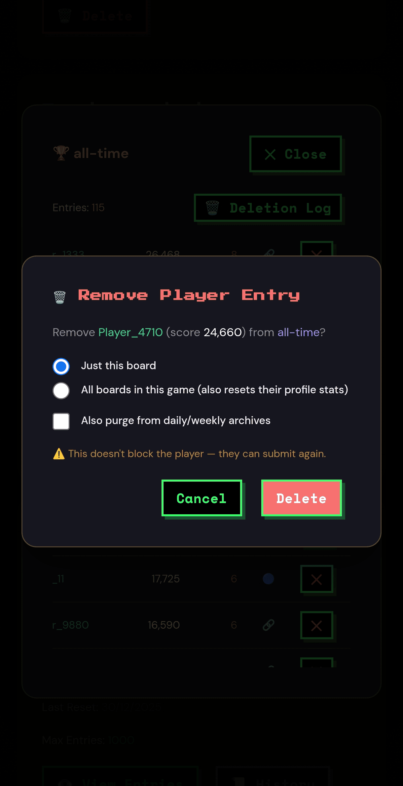

# Score Moderation

Remove unwanted entries from your leaderboards — test accounts, junk scores, or anything that shouldn't be there. Available to game owners from the developer dashboard.

## What you can do

| Action | Scope | Where |
|---|---|---|
| Delete a single entry | One score on one board | ✕ button on any row |
| Wipe a player | All of that player's scores across every board in your game | ✕ button → "All boards in this game" |
| Purge archives | Also removes the player's entries from archived daily/weekly boards | Checkbox in the confirm dialog |
| View deletion log | Audit trail of every deletion on your game | Deletion Log button on the board view |

## Deleting an entry

1. Open your game's scoreboard in the dashboard. As the owner you'll see the admin view — same board, plus a ✕ column.
2. Click ✕ on the entry you want gone.
3. In the **Remove Player Entry** dialog, choose the scope:
   - **Just this board** — removes that one score from that one board.
   - **All boards in this game** — wipes every score the player has on every board in this game. This also resets their profile stats (score, streak and play count go to zero). Achievements are kept.
4. Optionally tick **Also purge from daily/weekly archives** to remove them from archived boards too.
5. Confirm.

Changes are live immediately. Board caches are refreshed and entry counts update.

## Deletion is not a ban

Removing a player's scores does not stop them submitting again. If someone is actively spamming your board, deletion is cleanup, not prevention. A per-game blocklist is on the roadmap — until then, the anti-cheat parameters (score caps, time validation) in the Security tab are your prevention tools. See [anti-cheat.md](anti-cheat.md).

## The deletion log

Every deletion is recorded: what was removed, which board, the scope, whether archives were purged, and when. The log is per-game, visible only to you, and keeps the most recent 2000 records.

Player identifiers in the log are anonymised hashes — emails and account details are never exposed.

## Who can do this

Only the game owner (the account that registered the game). Deletion requests from anyone else are rejected. This works with both login methods on the dashboard.

## REST API

If you'd rather script it, the same operations are available over the HTTP API with your dashboard session:

| Method | Route | Does |
|---|---|---|
| GET | `/games/{gameId}/scoreboards/{boardId}/admin` | Admin view of a board (includes player keys) |
| DELETE | `/games/{gameId}/scoreboards/{boardId}/entries/{playerKey}` | Delete one entry |
| DELETE | `/games/{gameId}/players/{playerKey}/scores` | Wipe a player from all boards |
| GET | `/games/{gameId}/deletion-log` | Fetch the deletion log |

Add `?archives=true` to the DELETE routes to purge archives as well. The `playerKey` values come from the admin view route — they're stable per player per game.

## FAQ

**Can a deleted player come back?**
Yes — deletion removes their scores, nothing more. They can resubmit on their next play.

**Does wiping a player delete their account?**
No. It only clears their data in *your* game. Their account and their progress in other games are untouched.

**Can I undo a deletion?**
No. Deletions are permanent, which is why the confirm dialog exists. The deletion log tells you what was removed if you ever need to check.
